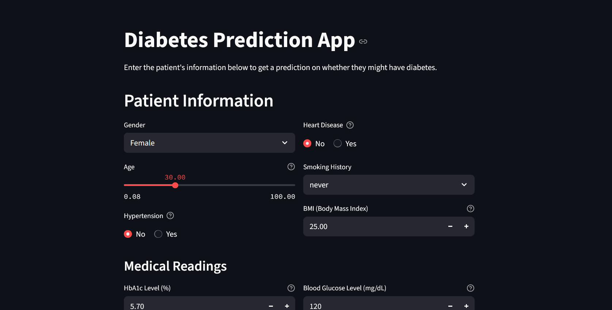

# 🩺 Diabetes Prediction using Machine Learning

A machine learning-powered web app for predicting the likelihood of diabetes based on patient health records. This project achieves an impressive **97.2% accuracy** using a well-processed dataset and includes a Streamlit-based deployment for real-time prediction.

## 📊 Dataset Used

- **Source:** [Diabetes Prediction Dataset on Kaggle](https://www.kaggle.com/datasets/iammustafatz/diabetes-prediction-dataset)
- **Features:**
  - Gender
  - Age
  - Hypertension
  - Heart Disease
  - Smoking History
  - BMI
  - HbA1c Level
  - Blood Glucose Level

## 🔍 Project Overview

The objective of this project is to classify whether a person is likely to have diabetes based on various medical and lifestyle features using supervised machine learning.

### 🎯 Model Highlights

- Achieved **~97.2% accuracy**
- Applied **SMOTE** for handling imbalanced data
- Feature Engineering and EDA included
- Clean and interactive **Streamlit web interface**
- Deployment-ready pipeline using **joblib**

## 📁 File Structure

```bash
.
├── data/
│   └── diabetes_prediction_dataset.csv
│
├── Deployment/
│   ├── Deployment_Code.py
│   └── diabetes_prediction_pipeline_V2.pkl
│
├── Notebook/
│   ├── Diabetes_prediction_model_smote.ipynb
│   ├── Diabetes_prediction_model.ipynb
│   ├── understanding data.ipynb
│   └── diabetes_prediction_pipeline_V2.pkl  # duplicate model (optional)
│
└── README.md

```

## 🧪 Tech Stack

- **Language:** Python
- **Libraries:** scikit-learn, pandas, numpy, seaborn, matplotlib, joblib, xgboost
- **Web App:** Streamlit

## 🚀 How to Run the Project

### 1. Clone the Repository

```bash
git clone https://github.com/your-username/diabetes-prediction-ml.git
cd diabetes-prediction-ml
```

### 2. Install Requirements

```bash
pip install -r requirements.txt
```

### 3. Add the Trained Model

Make sure to place the file `diabetes_prediction_pipeline_V2.pkl` in the same directory as `Deployment_Code.py`.

### 4. Run the Web App

```bash
streamlit run Deployment_Code.py
```

## 🧠 Model Training & Evaluation

- Various classifiers were tested (Logistic Regression, Random Forest, etc.)
- Best-performing model was chosen based on precision-recall, ROC-AUC, and accuracy
- SMOTE was used to handle class imbalance effectively
- Final model trained on full processed dataset and serialized using `joblib`

## 📷 App UI Preview

> **

## ⚠️ Disclaimer

This project is for educational purposes only. It is not a substitute for professional medical diagnosis. Always consult with a licensed healthcare provider for medical advice.

## 🙌 Acknowledgements

- Kaggle Dataset by [iammustafatz](https://www.kaggle.com/datasets/iammustafatz/diabetes-prediction-dataset)
- Inspired by the importance of early diabetes detection
